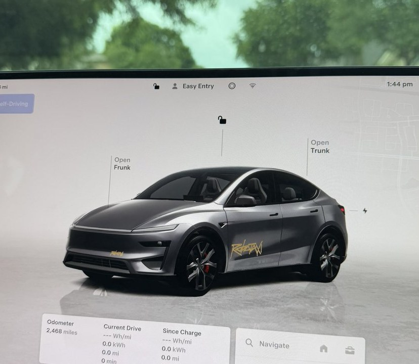
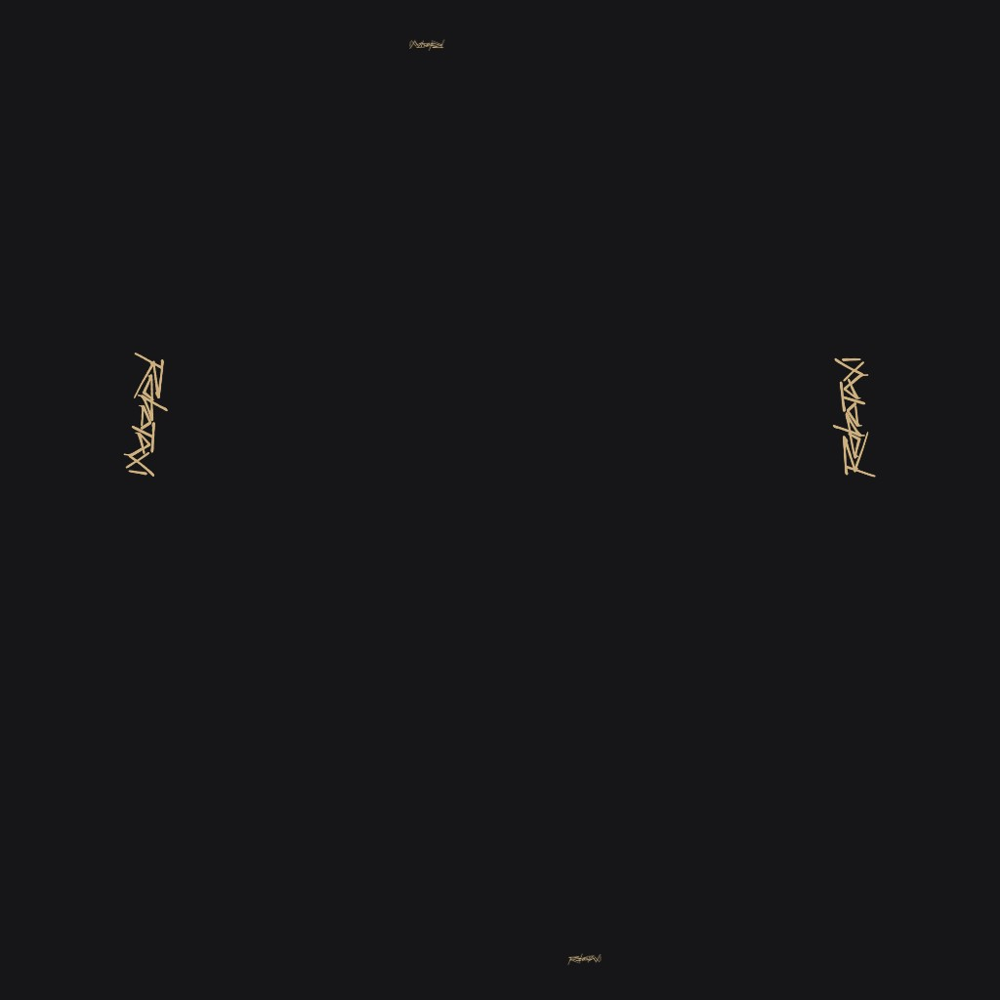

# Robotaxi wraps for Tesla display

Unofficial Paint Shop files. Gold graffiti on the **3D car in Toybox / the Tesla app**

Not affiliated with Tesla, Inc.



Folder names match Tesla’s public [custom-wraps](https://github.com/teslamotors/custom-wraps) templates so you download the file for the same model.

## Why `Robotaxi.png` looks blank on GitHub

That’s the actual wrap. It is a 1024×1024 transparent UV map. GitHub shows it on white, so you barely see anything. Paint Shop only draws the gold pixels onto the car.

The photo above is what it looks like on the display. The map Tesla reads:



## Install

### Tesla app (4.59.0+)

1. Download `Robotaxi.png` from your model folder (table below).
2. App → **Creations → Wrap → Upload**.
3. In the car: **Toybox → Paint Shop → Wraps → Robotaxi**.

### USB

1. Format the drive as exFAT or FAT32 (not NTFS).
2. Folder named `Wraps` at the root.
3. Put `Robotaxi.png` in that folder.
4. **Toybox → Paint Shop → Wraps**.

```
USB Drive
└── Wraps/
    └── Robotaxi.png
```

One-word filename on purpose. Paint Shop allows letters, numbers, spaces, `_` and `-`, max 30 characters.

## Models

| Vehicle | Folder | File |
|---|---|---|
| Model Y 2025+ Performance | [`modely-2025-performance/`](modely-2025-performance/) | `Robotaxi.png` |
| Model Y 2025+ Premium | [`modely-2025-premium/`](modely-2025-premium/) | `Robotaxi.png` |
| Model Y 2025+ Standard | [`modely-2025-base/`](modely-2025-base/) | `Robotaxi.png` |
| Model Y Legacy (2020–24) | [`modely/`](modely/) | `Robotaxi.png` |
| Model 3 Highland Performance | [`model3-2024-performance/`](model3-2024-performance/) | `Robotaxi.png` |
| Model 3 Highland Standard / Premium | [`model3-2024-base/`](model3-2024-base/) | `Robotaxi.png` |
| Model 3 Legacy (2017–23) | [`model3/`](model3/) | `Robotaxi.png` |
| Model S 2025+ Plaid | [`models-2025-plaid/`](models-2025-plaid/) | `Robotaxi.png` |
| Model S 2021+ | [`models-2021/`](models-2021/) | `Robotaxi.png` |
| Model X 2021+ | [`modelx-2021/`](modelx-2021/) | `Robotaxi.png` |
| Cybertruck | [`cybertruck/`](cybertruck/) | `Robotaxi.png` |

## File rules

- PNG only
- 512×512 to 1024×1024, max 1 MB
- Up to 10 from the app and 10 from USB

## Not Tesla

Fan project for personal Paint Shop use. Tesla, Model names, and Robotaxi are trademarks of Tesla, Inc. Do not use these as a physical livery to impersonate a Tesla Robotaxi.
